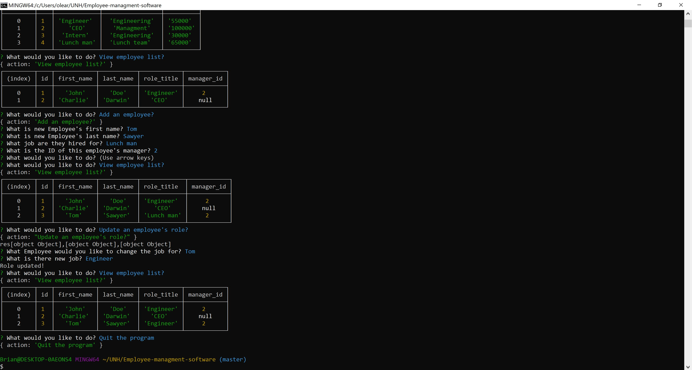
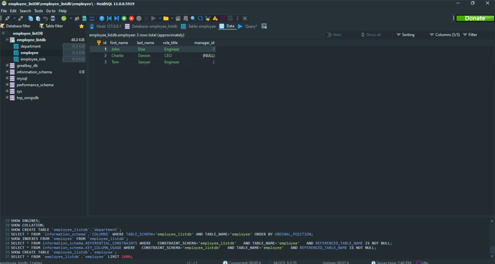

# Employee-managment-software
## Live website URL:
[live website](https://boleary1.github.io/Employee-managment-software/)
 
[GitHub Repository](https://github.com/boleary1/Employee-managment-software)
 

[Youtube link](https://youtu.be/Y7Pl-8NT3wk)

## **Description:**
Application built in Mid September 2020.  Connects to a database you can add and update items in the database.  

Last edit was 9/11/2020 by Brian O'leary.  Contact oleary.brian1@gmail.com with any questions.

## **Screenshot:**

## license:
  MIT_License
  
  ## Contributing:
  Yes, clone the repository make your edits and then create a push request to be reviewed.  

  ## Testing:
  No.

## **Instructions:**
Download the the repositoty to your local machine. create the database using the Schema file.  Open the file in your terminal.  Type "npm start" and follow the instructions.  